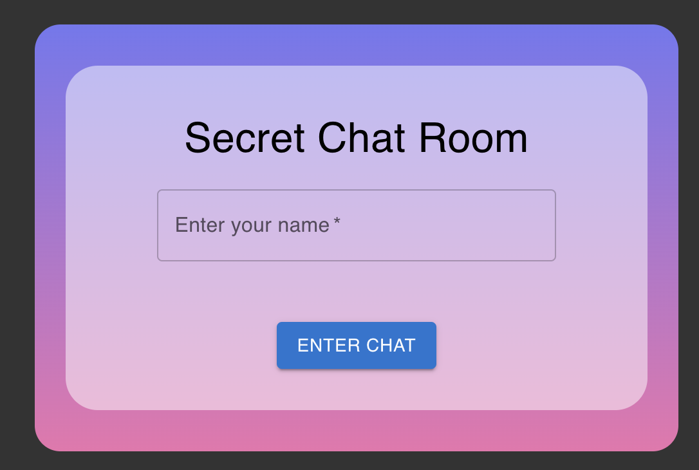

# 聊聊不留痕 - Secret Chat Room
Secret Chat Room 是個基於 Socket.io 建立的無痕聊天的網站，UI 使用 Material UI (MUI) 建立。內容具有公開聊天室及私人聊天室，離開聊天室後，訊息自動消去不留痕。


## Website - 網站展示
- [聊聊不留痕網站 Secret Chat Room](https://chat-room-client-two.vercel.app/)
- [後端 repo](https://github.com/James-Lee-01/chat-room-server)




## Features - 產品功能
- 自訂暱稱。
- 具公開聊天室，快速與線上使用者聊天。
- 具私人聊天室，與聊天對象自訂房號即可進入。
- 聊天室上方顯示聊天室內使用者。
- 聊天室內使用者 進入 / 離開 通知。
- 關閉視窗自動登出。

## How to Use - 網站使用說明
1. 輸入欲使用之暱稱進入。
2. 選擇聊天室種類：
   - 公開 聊天室：
       - 聊天室上方會顯示聊天室內成員。
   - 私人 聊天室：
       - 輸入 房間號碼 加入聊天室。
       - 聊天室上方會顯示房號及聊天室成員。
3. 點選 離開(Leave) 可返回上一頁。
4. 點選 登出(Logout) 可回到首頁或更換暱稱進入。

> [!CAUTION]
> 離開聊天室 或 按下重新整理 皆會自動清除所有聊天紀錄。

## Setup and Activation - 環境建置與啟用
### 後端：
1. 請先確認已安裝 Node.js 與 npm。
2. 開啟終端機(Terminal)進入到存放後端專案的本機位置，執行以下將 **「後端」** 專案 clone ： 

    ```
    git clone https://github.com/James-Lee-01/chat-room-server.git
    ```
3. 進入存放此專案的資料夾，開啟之後，透過終端機輸入：

   ```bash
   npm install
   ```

4. 安裝完畢後，執行程式：
   ```bash
   node chatRoomServer.js
   ```

5. 出現紫下訊息則代表成功執行後端 server ：
   ```bash
   Server is running on port 3001
   ```

6. 若欲暫停使用 server 請執行以下：

   ```bash
   ctrl + c
   ```

### 前端：
1. 請先確認已安裝 Node.js 與 npm。
2. 開啟終端機(Terminal)進入到存放專案的本機位置，執行以下將 **「前端」** 專案 clone ： 

    ```
    git clone https://github.com/James-Lee-01/chat-room-client.git
    ```
3. 進入存放此專案的資料夾，開啟之後，透過終端機輸入：

   ```bash
   npm install
   ```

4. 安裝完畢後，執行程式：
    ```
    npm start
    ```

5. 打開瀏覽器進入到以下網址：`http://localhost:3000` 執行，出現以下訊息則代表成功執行：

   ```bash
   webpack compiled successfully
   ```
    

6. 若欲暫停使用請執行以下：

   ```bash
   ctrl + c
   ```

## Development Tools - 開發工具
- @mui/material: v5.14.18
- React: v18.2.0
- React-dom: v18.2.0
- React-router-dom: v6.16.0
- Socket.io: v4.7.2
- Socket.io-client: v4.7.2
- UUID: v9.0.1